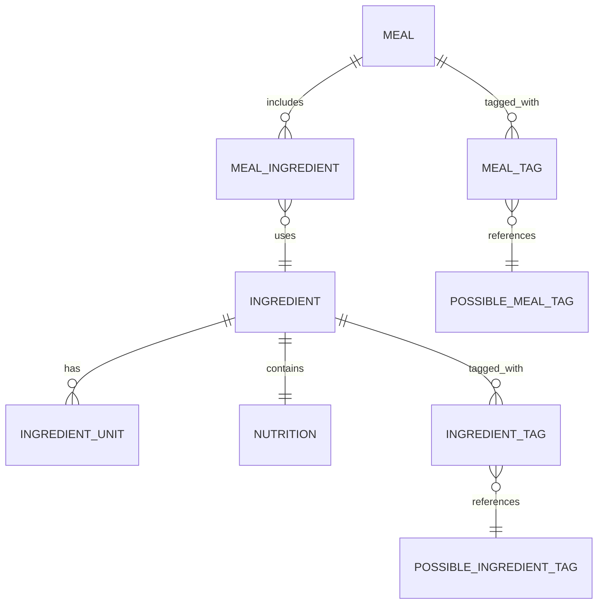
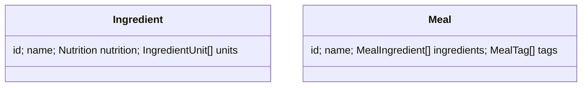

# 🍽️ Nutrition Tracker

A full-stack nutrition planning and tracking app built with:

* 🖥️ **React** frontend (Material UI + Context API)
* 🐍 **FastAPI** backend (SQLAlchemy + Pydantic)
* 🐘 **PostgreSQL** database (seeded with food and nutrition data)
* 🐳 **Docker** for development and deployment

---

## 🚀 Quick Start

### 1. Install prerequisites

* [Docker Desktop](https://www.docker.com/products/docker-desktop) (✅ check “Add to PATH” during install)
* [DBeaver Community](https://dbeaver.io/download/) (for exploring the database, optional)
* [PowerShell 7+](https://learn.microsoft.com/powershell/) (Windows/macOS/Linux)

### 2. Clone & launch

```pwsh
# Clone the repository
git clone https://github.com/alexandrugavrila/Nutrition
cd Nutrition

# Start all services for the current branch
# Pick ONE: -production | -test | -empty
pwsh ./scripts/compose-up-branch.ps1 -test
```

👉 On startup, the script prints the **branch-specific ports** for the frontend, backend, and database.
Multiple branches can run in parallel without conflict.

### 3. Access services

* Frontend: [http://localhost:\<FRONTEND\_PORT>](http://localhost:3000)
* Backend API: [http://localhost:\<BACKEND\_PORT>](http://localhost:8000)
* PostgreSQL: `localhost:<DB_PORT>`

## 🐍 Virtual Environment

All development should be run from inside the project's Python virtual environment. Use the helper script to create and activate it:

```powershell
pwsh ./scripts/activate-venv.ps1
```

The script creates the `.venv` directory if needed and installs required dependencies.

## ▶️ Run the Backend

Start the FastAPI application locally with [uvicorn](https://www.uvicorn.org/):

```bash
uvicorn Backend.backend:app --reload
```

The server will be available at <http://localhost:8000> by default.

---

## 🗂️ Project Structure

```
Nutrition/
├── Backend/                     # FastAPI app
│   ├── db_models/              # SQLAlchemy ORM models
│   ├── models/                 # Pydantic models
│   ├── routes/                 # Ingredient and meal routes
│   ├── backend.py              # FastAPI entrypoint
│   ├── db.py                   # SQLAlchemy setup
│   └── Dockerfile              # Backend build config
│
├── Frontend/
│   └── nutrition-frontend/     # React app
│       ├── src/                # App components, context, etc.
│       ├── Dockerfile          # Frontend build config
│       └── nginx.conf          # Nginx static serving config
│
├── Database/                   # SQL seed scripts
│   ├── createtables.sql
│   ├── addingredients.sql
│   └── addnutrition.sql
│
├── docker-compose.yml          # Orchestration config
└── scripts/
    ├── compose-up-branch.ps1   # Start stack with branch-specific ports
    ├── compose-down-branch.ps1
    ├── import-from-csv.sh
    └── activate-venv.ps1       # Create and activate the venv
```

---

## 🧠 Core Concepts

* **Backend**

  * API routes in `Backend/routes/`
  * SQLAlchemy models in `db_models/`, validated by Marshmallow `schemas/`

* **Frontend**

  * Built in `Frontend/nutrition-frontend/`
  * Uses global `DataContext.js` to fetch and manage meals, ingredients, and tags

* **Database**

  * Seeded with initial tables + nutrition data from `Database/`
  * Can be reset or re-imported (see contributing guide)

---

## 📖 More for Contributors

* Branch naming conventions
* Port offset system (per-branch)
* Database reset/import scripts
* Local (non-Docker) dev setup

👉 See [CONTRIBUTING.md](CONTRIBUTING.md) for full developer setup and workflows.

---

## ✅ API Endpoints (Highlights)

### Ingredients

* `GET /ingredients` – all ingredients
* `POST /ingredients` – add ingredient
* `PUT /ingredients/<id>` – update ingredient
* `DELETE /ingredients/<id>` – delete ingredient
* `GET /ingredients/possible_tags` – list possible ingredient tags

### Meals

* `GET /meals` – all meals
* `GET /meals/<id>` – single meal
* `GET /meals/possible_tags` – list possible meal tags
  ⚠️ Meal `POST/PUT/DELETE` endpoints are currently commented out

---

## 📊 Diagrams

<details>
<summary>Backend Schema (Mermaid)</summary>



</details>

<details>
<summary>Frontend Structures (Mermaid)</summary>



</details>

---

## 🤝 Contributing

See [CONTRIBUTING.md](CONTRIBUTING.md) for full developer setup, scripts, and workflows.

---