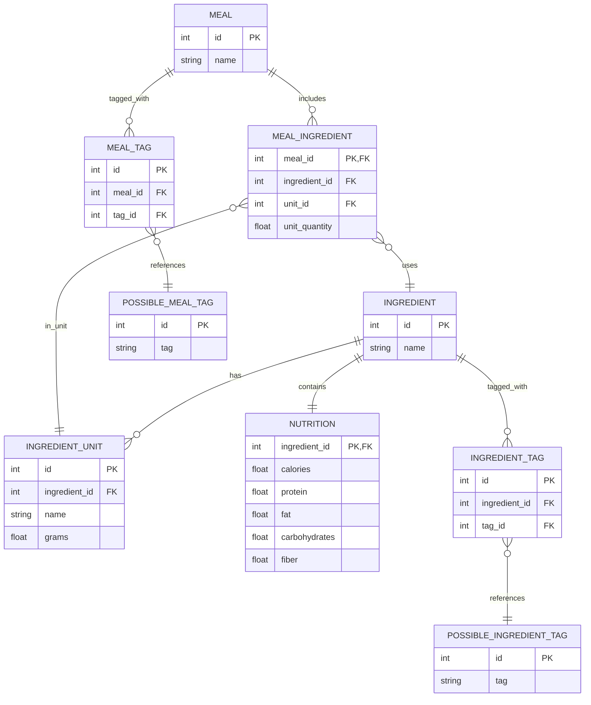
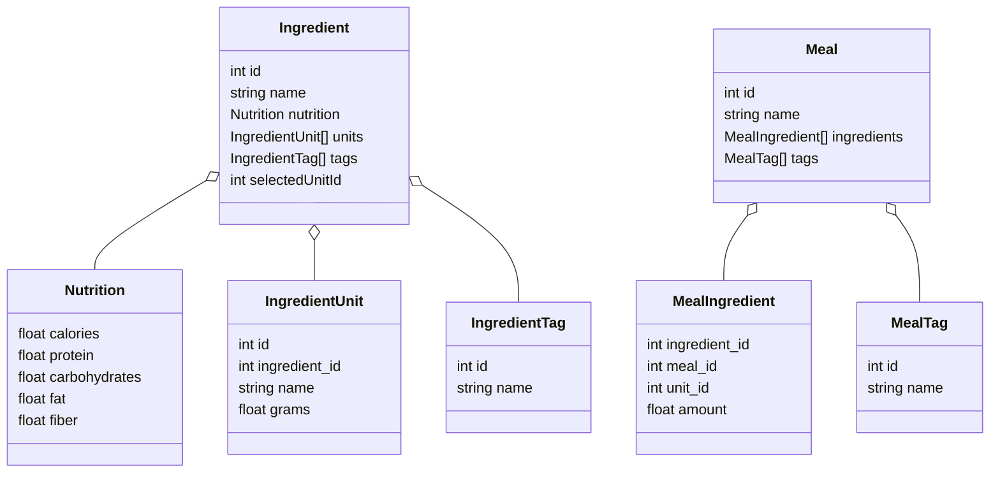

# 🍽️ Nutrition Tracker

A full-stack nutrition planning and tracking app built with:

- 🖥️ **React** frontend (using Context and Material UI)
- 🐍 **Flask** backend (with SQLAlchemy)
- 🐘 **PostgreSQL** database (seeded with food and nutrition data)
- 🐳 Docker for development and deployment

---

## 🚀 Quick Start (Docker)

```bash
# Clone the repository
git clone <your-repo-url>
cd Nutrition

# Start all services
docker-compose up --build
```

* Frontend: [http://localhost:3000](http://localhost:3000)
* Backend API: [http://localhost:5000](http://localhost:5000)

> 📝 The database is seeded automatically on first run using `Database/createtables.sql`, `addingredients.sql`, and `addnutrition.sql`.

---

## 🗂️ Project Structure

```
Nutrition/
├── Backend/                     # Flask app
│   ├── data_models/            # Serializable API-facing models
│   ├── db_models/              # SQLAlchemy ORM models
│   ├── routes/                 # Ingredient and meal routes
│   ├── backend.py              # Main Flask entrypoint
│   ├── db.py                   # SQLAlchemy setup
│   └── Dockerfile              # Backend build config
│
├── Frontend/
│   └── nutrition-frontend/     # React app
│       ├── src/                # App components, context, etc.
│       ├── Dockerfile          # Frontend build config
│       └── nginx.conf          # Nginx static serving config
│
├── Database/                   # SQL seed scripts
│   ├── createtables.sql
│   ├── addingredients.sql
│   └── addnutrition.sql
│
├── docker-compose.yml          # Orchestration config
└── scripts/
    └── print-tree.ps1          # Dev tooling
```

---

## ⚙️ Environment and Configuration

| Service    | Port | Description                    |
| ---------- | ---- | ------------------------------ |
| Frontend   | 3000 | React app served via Nginx     |
| Backend    | 5000 | Flask API                      |
| PostgreSQL | 5432 | Nutrition DB with initial data |

Environment variables are defined in `docker-compose.yml`:

```yaml
POSTGRES_USER: nutrition_user
POSTGRES_PASSWORD: nutrition_pass
POSTGRES_DB: nutrition
```

Backend connects using:

```
postgresql://nutrition_user:nutrition_pass@db:5432/nutrition
```

---

### 🛠️ Database Access with DBeaver

DBeaver is a free and powerful GUI for inspecting your PostgreSQL database. You can use it to explore tables, run queries, and debug data directly.

#### 🔽 Step 1: Install DBeaver

* Download and install the Community Edition from:
  👉 [https://dbeaver.io/download/](https://dbeaver.io/download/)

---

#### ⚙️ Step 2: Connect to the Dockerized Database

1. **Open DBeaver** and click `Database → New Database Connection`
2. Choose **PostgreSQL** and click **Next**
3. Enter the following connection info:

| Field        | Value            |
| ------------ | ---------------- |
| **Host**     | `localhost`      |
| **Port**     | `5432`           |
| **Database** | `nutrition`      |
| **Username** | `nutrition_user` |
| **Password** | `nutrition_pass` |

4. Click **Test Connection**.
   If prompted to download the PostgreSQL driver, allow it.
5. Click **Finish** to connect.

> 📝 If the connection fails, make sure the Docker containers are running with:
>
> ```bash
> docker-compose up
> ```

---

## 🧠 Core Concepts

### Backend (Flask)

* All API routes are defined under `Backend/routes/`
* Data is fetched from `db_models/` and converted to serialized `data_models/` for clean API responses
* Main routes:

  * `GET /ingredients`
  * `POST /ingredients`
  * `PUT /ingredients/<id>`
  * `DELETE /ingredients/<id>`
  * `GET /ingredients/possible_tags`
  * (same for `/meals`, not shown here)

### Frontend (React)

* Built in `Frontend/nutrition-frontend`
* `App.js` renders:

  * `<MealData />`
  * `<IngredientData />`
* Data is managed globally via `DataContext.js`

  * Automatically fetches:

    * All ingredients and meals
    * All possible tags
  * Categorizes tags into `group`, `processing`, `type`, and `diet`

---

## 👩‍💻 For Developers

### Branch naming convention
type/issue-in-kabob-case

Types:
  Feature
  Refactor
  Bugfix
  Housekeeping


### Rebuilding Containers

To manually rebuild containers after a code change

```bash
docker-compose down -v
docker-compose up --build
```

Data will persist as long as you do not also delete the Docker volume

### Database management

The Python script import_from_csv.py will remove all existing data from the database and import the specified data. 

To import production data

```python
python .\Database\import_from_csv.py 
```

To import test data

```python
python .\Database\import_from_csv.py --test
```

### Local Development (non-Docker)

**Backend:**

Virtual Environment Setup
```bash
python -m venv .venv
.\.venv\Scripts\Activate
pip install -r Backend/requirements.txt
```

Launch Backend
```bash
python backend.py
```

**Frontend:**

Launch Frontend
```bash
cd Frontend/nutrition-frontend
npm install
npm start
```

---

## ✅ API Endpoints

### 🥕 **Ingredients**

| Method | Endpoint                     | Description                              |
| ------ | ---------------------------- | ---------------------------------------- |
| GET    | `/ingredients`               | Get all ingredients                      |
| GET    | `/ingredients/<id>`          | Get a specific ingredient by ID          |
| POST   | `/ingredients`               | Add a new ingredient                     |
| PUT    | `/ingredients/<id>`          | Update an existing ingredient            |
| DELETE | `/ingredients/<id>`          | Delete an ingredient                     |
| GET    | `/ingredients/possible_tags` | Get list of all possible ingredient tags |

---

### 🍽️ **Meals**

| Method | Endpoint               | Description                        |
| ------ | ---------------------- | ---------------------------------- |
| GET    | `/meals`               | Get all meals                      |
| GET    | `/meals/<id>`          | Get a specific meal by ID          |
| GET    | `/meals/possible_tags` | Get list of all possible meal tags |

---

### 🚧 **Commented Out / Incomplete Endpoints**

The following endpoints are defined but **commented out** in your `routes/meals.py`. They appear to be part of CRUD functionality for meals but are currently non-functional:

| Method | Endpoint      | Description             |
| ------ | ------------- | ----------------------- |
| POST   | `/meals`      | Add a new meal          |
| PUT    | `/meals/<id>` | Update an existing meal |
| DELETE | `/meals/<id>` | Delete a meal           |

---

## 🎨 Backend Mermaid Diagram

<details>
<summary>📊 Click to expand Backend Mermaid diagram</summary>



</details>


---

### 🧩 Frontend Data Structures (JavaScript)

<details>
<summary>📊 Click to expand Frontend Mermaid diagram</summary>



</details>