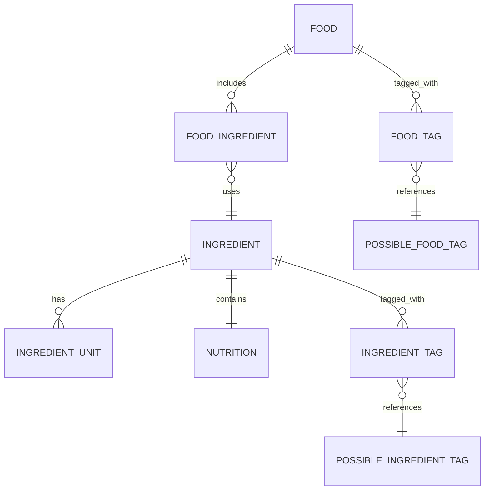
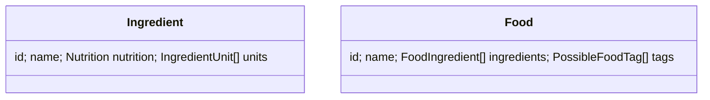

# Nutrition Tracker

A full-stack nutrition planning and tracking app built with:

- React 18 + Vite + Material UI frontend
- FastAPI + SQLModel backend
- PostgreSQL database seeded with curated food data
- Docker Compose orchestrated by branch-aware helper scripts

---

## Quick Start

1. Clone the repository.

   ```pwsh
   git clone https://github.com/alexandrugavrila/Nutrition
   cd Nutrition
   ```

2. (Optional) Create or jump to a dedicated worktree when you want hot reload and database state isolated per branch.

   ```pwsh
   pwsh ./scripts/switch-worktree-branch.ps1 feature/my-feature
   ```
   - The script creates `../nutrition-feature-my-feature` if needed and reopens the folder in VS Code (use `-SkipVSCode` to opt out).
   - Worktrees let every branch mount its own code directory and Postgres volume, so multiple stacks can run in parallel.

   Bash users can run the script through `pwsh` (PowerShell 7+ is cross-platform).

3. Activate the developer environment (installs backend dependencies and keeps the virtualenv up to date).

   ```pwsh
   pwsh ./scripts/env/activate-venv.ps1
   # or
   source ./scripts/env/activate-venv.sh
   ```

   To verify the current shell is in the right worktree with an active venv, run `pwsh ./scripts/env/check.ps1 -Fix` (or `./scripts/env/check.sh --fix`).

4. Start the branch-local Docker stack.

   ```pwsh
   pwsh ./scripts/docker/compose.ps1 up data -test
   ```
   - Replace `-test` with `-prod` to restore the latest branch backup (falls back to CSV seeding if no dump exists).
   - Add `type -test` to run on the dedicated test ports (used by the end-to-end suite).

   The script prints the branch-specific ports and waits until the services are ready:
   - Frontend: `http://localhost:<DEV_FRONTEND_PORT>`
   - Backend API: `http://localhost:<DEV_BACKEND_PORT>/docs`
   - PostgreSQL: `localhost:<DEV_DB_PORT>`

5. Visit the printed URLs or connect a SQL client (default credentials: `nutrition_user` / `nutrition_pass`).

See [CONTRIBUTING.md](CONTRIBUTING.md) for the full contributor workflow.

---

## Key Helper Scripts

- `pwsh ./scripts/repo/check.ps1`: fetch latest refs, audit worktrees, flag stale container stacks, and suggest fixes. Bash: `./scripts/repo/check.sh`.
- `pwsh ./scripts/switch-worktree-branch.ps1`: create or hop between branch-dedicated worktrees.
- `pwsh ./scripts/env/check.ps1 -Fix`: ensure you are inside the correct worktree with an activated virtualenv (Bash variant available).
- `pwsh ./scripts/docker/compose.ps1 <up|down|restart>`: manage the per-branch Docker stack.
- `pwsh ./scripts/run-tests.ps1 [-sync] [-e2e]`: run backend + frontend tests with optional API/migration sync. Bash variant: `./scripts/run-tests.sh`.
- `pwsh ./scripts/db/backup.ps1` / `restore.ps1`: create or restore branch-local Postgres backups. Bash variants available in the same directory.
- `pwsh ./scripts/db/export-to-csv.ps1` / `./scripts/db/export-to-csv.sh`: export the current database tables to CSV (production by default, `--test` or `--output-dir` available).

---

## Worktrees & Branch Isolation

- The default branch (`main`) lives in the primary clone.
- Feature branches should run from sibling worktrees named `nutrition-<sanitized-branch>`.
- Each worktree gets unique compose project names, container names, ports, and Postgres volumes via the branch-aware scripts.
- Run `pwsh ./scripts/repo/sync-branches.ps1` to mirror new remote branches and `pwsh ./scripts/repo/audit-worktrees.ps1` to confirm every branch maps to exactly one worktree.
- More details and troubleshooting live in [CONTRIBUTING.md](CONTRIBUTING.md#branching--worktrees).

---

## Project Structure

```
Nutrition/
├── Backend/       # FastAPI app (routes, models, migrations)
├── Frontend/      # React app (Vite + Material UI)
├── Database/      # CSV seed data and backup scripts
├── docker-compose.yml
└── scripts/       # Cross-platform helper scripts
    ├── db/        # Database + OpenAPI utilities
    ├── docker/    # Compose orchestration
    ├── env/       # Virtualenv + environment checks
    ├── lib/       # Shared script helpers
    ├── repo/      # Worktree and branch management
    └── tests/     # E2E harness
```

---

## Core Concepts

- **Backend** – FastAPI routes under `Backend/routes`, models in `Backend/models`, migrations in `Backend/migrations`.
- **Frontend** – React application under `Frontend/` with shared state in `Frontend/src/contexts`.
- **Database** – Postgres schema managed by Alembic; branch scripts seed either test or production-style fixtures.
- **Automation** – Helper scripts keep API artifacts (OpenAPI + TypeScript types) and migrations in sync.

---

## API Highlights

- `GET /api/ingredients` / `POST /api/ingredients` – list and create ingredients.
- `GET /api/foods` / `POST /api/foods` – list and create composite foods.
- `GET /api/ingredients/possible_tags` / `GET /api/foods/possible_tags` – discover available filters.

Detailed endpoint documentation is available at `http://localhost:<DEV_BACKEND_PORT>/docs` when the backend container is running.

---

## Diagrams

<details>
<summary>Backend Schema (Mermaid)</summary>



</details>

Frontend state mirrors the API schema, so food tags reference the shared `PossibleFoodTag` definitions surfaced by `/api/foods/possible_tags`.

<details>
<summary>Frontend Structures (Mermaid)</summary>



</details>

---

## Contributing

For environment setup, migrations, API schema generation, commit checklist, and CI details, read [CONTRIBUTING.md](CONTRIBUTING.md).

