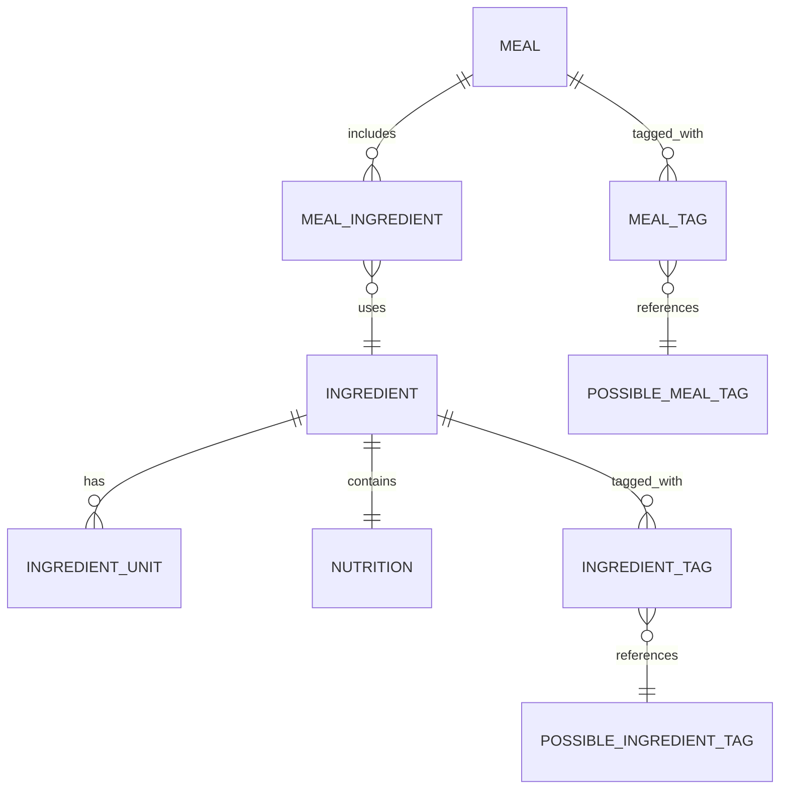
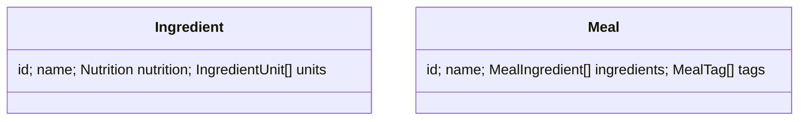

# 🍽️ Nutrition Tracker

A full-stack nutrition planning and tracking app built with:

- 🖥️ **React** frontend (Material UI + Context API)
- 🐍 **FastAPI** backend (SQLModel)
- 🐘 **PostgreSQL** database (seeded with food and nutrition data)
- 🐳 **Docker** for development and deployment

---

## 🚀 Quick Start

### 1. Prerequisites

- [Docker Desktop](https://www.docker.com/products/docker-desktop)
- [PowerShell 7+](https://learn.microsoft.com/powershell/) (Windows/macOS/Linux)
- [DBeaver](https://dbeaver.io/download/) (optional, DB GUI)

### 2. Clone & Launch

```pwsh
git clone https://github.com/alexandrugavrila/Nutrition
cd Nutrition

# Start stack for this branch
# Choose ONE: -production | -test | -empty
pwsh ./scripts/docker/compose.ps1 up -test
```

👉 The script prints the branch-specific ports for frontend, backend, and database.
Multiple branches can run in parallel without conflicts.

### 3. Access Services

- Frontend → `http://localhost:<FRONTEND_PORT>`
- Backend API → `http://localhost:<BACKEND_PORT>`
- PostgreSQL → `localhost:<DB_PORT>`

### 4. Environment Variables

The frontend dev server proxies `/api` requests to the backend. By default it targets the branch-specific port printed above. Set `BACKEND_URL` to point at a different backend host.

### 5. Frontend Commands

Run the React app directly without Docker:

```bash
npm --prefix Frontend run dev     # start dev server
npm --prefix Frontend run build   # production build
npm --prefix Frontend run preview # preview build
```

See [CONTRIBUTING.md](CONTRIBUTING.md) for full contributor workflow details.

---

## 🗂️ Project Structure

```
Nutrition/
├── Backend/        # FastAPI app (models, routes, db)
├── Frontend/       # React app
├── Database/       # CSV seed data + import utils
├── docker-compose.yml
└── scripts/        # Helper scripts
    ├── docker/     # Compose up/down and stack management
    ├── db/         # Database and API schema utilities
    ├── env/        # Virtualenv setup helpers
    └── tests/      # Test runners and helpers
```

---

## 🧠 Core Concepts

- **Backend** → API routes in `Backend/routes/`, models in `Backend/models/`
- **Frontend** → React app in `Frontend/`, global `DataContext.js` for state
- **Database** → Schema managed with Alembic migrations, optional CSV seed data

---

## ✅ API Endpoints

**Ingredients**

- `GET /ingredients` – list all
- `GET /ingredients/{id}` – single ingredient
- `GET /ingredients/possible_tags` – list tags
- `POST /ingredients` – add new
- `PUT /ingredients/{id}` – update
- `DELETE /ingredients/{id}` – remove

Every ingredient response automatically includes a synthetic `1g` unit for convenience.

**Meals**

- `GET /meals` – list all
- `GET /meals/{id}` – single meal
- `GET /meals/possible_tags` – list tags
- `POST /meals` – add new
- `PUT /meals/{id}` – update
- `DELETE /meals/{id}` – remove

---

## 📊 Diagrams

<details>
<summary>Backend Schema (Mermaid)</summary>



</details>

<details>
<summary>Frontend Structures (Mermaid)</summary>



</details>

---

## 🤝 Contributing

For **developer setup, migrations, OpenAPI generation, commit checklist, and CI/CD details**, see
👉 [CONTRIBUTING.md](CONTRIBUTING.md)
