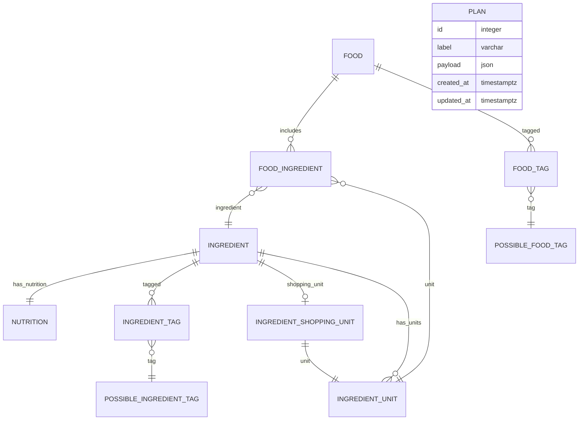
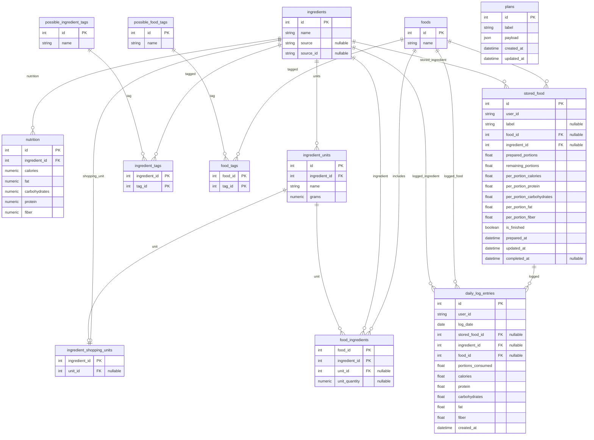
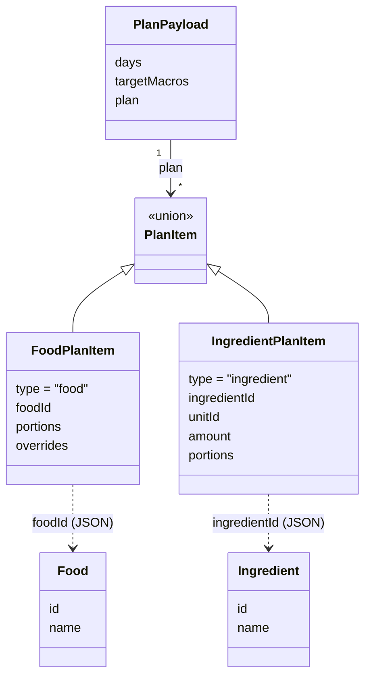
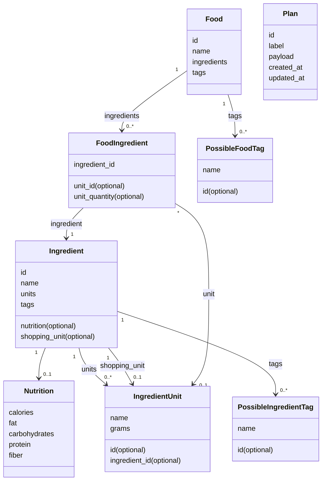

# Nutrition Tracker

A full-stack nutrition planning and tracking app built with:

- React 18 + Vite + Material UI frontend
- FastAPI + SQLModel backend
- PostgreSQL database seeded with curated food data
- Docker Compose orchestrated by branch-aware helper scripts

---

## Quick Start

1. Clone the repository (recommended layout keeps the primary clone under a parent `Nutrition` folder so worktrees are siblings).

   ```pwsh
   git clone https://github.com/alexandrugavrila/Nutrition C:\_Code\Nutrition\nutrition-main
   cd C:\_Code\Nutrition\nutrition-main
   ```

   You can choose any parent directory; just keep the primary clone in its own subfolder.

2. (Optional) Create or jump to a dedicated worktree when you want hot reload and database state isolated per branch.

   ```pwsh
   pwsh ./scripts/switch-worktree-branch.ps1 feature/my-feature -CopyEnv
   ```
   - The script fetches remote refs, creates local tracking branches for remote-only branches, then creates `nutrition-feature-my-feature` under the worktree parent (default: parent of the primary clone) and reopens the folder in VS Code (use `-SkipVSCode` to opt out).
   - Worktrees let every branch mount its own code directory and Postgres volume, so multiple stacks can run in parallel.

   Bash users can run the script through `pwsh` (PowerShell 7+ is cross-platform).

3. Create your local environment file.

   ```pwsh
   Copy-Item .env.template .env
   ```

   Then fill in `USDA_API_KEY`.

4. Activate the developer environment (installs backend dependencies and keeps the virtualenv up to date).

   ```pwsh
   pwsh ./scripts/env/activate-venv.ps1
   # or
   source ./scripts/env/activate-venv.sh
   ```

   To verify the current shell is in the right worktree with an active venv, run `pwsh ./scripts/env/check.ps1 -Fix` (or `./scripts/env/check.sh --fix`).

5. Start the branch-local Docker stack.

   ```pwsh
   pwsh ./scripts/docker/compose.ps1 up data -test
   ```
  - Replace `-test` with `-prod` for production-like startup (no automatic seed or restore).
    Run migrations explicitly before serving traffic: `pwsh ./scripts/db/migrate.ps1` (or `./scripts/db/migrate.sh`).
    CSV fixture import remains available for local/test workflows and requires explicit confirmation for production mode.
   - Add `type -test` to run on the dedicated test ports (used by the end-to-end suite).

   The script prints the branch-specific ports and waits until the services are ready:
   - Frontend: `http://localhost:<DEV_FRONTEND_PORT>`
   - Backend API: `http://localhost:<DEV_BACKEND_PORT>/docs`
   - PostgreSQL: `localhost:<DEV_DB_PORT>`

6. Visit the printed URLs or connect a SQL client using the database credentials you injected through environment variables (never commit real secrets).

See [CONTRIBUTING.md](CONTRIBUTING.md) for the full contributor workflow.

---


## Development vs Production Compose

- `docker-compose.yml` is **development-only**. It builds local images, bind-mounts `Backend/` and `Frontend/`, and enables hot reload for iterative coding.
- `docker-compose.prod.yml` is **production-focused**. It runs prebuilt immutable images, uses an `env_file` (`.env.production`), enforces required runtime variables via `${VAR:?error}` checks, and persists only PostgreSQL data in a named volume. Start from `.env.production.example` when creating the production env file.

Production entrypoint example:

```bash
docker compose --env-file .env.production -f docker-compose.prod.yml up -d
```

Manual production helper scripts:

```bash
./scripts/prod/backup.sh --label manual
./scripts/prod/deploy.sh 1.2.0-alpha
./scripts/prod/migrate.sh
./scripts/prod/rollback.sh 1.1.9
```

```pwsh
pwsh ./scripts/prod/backup.ps1 -Label manual
pwsh ./scripts/prod/deploy.ps1 -Tag 1.2.0-alpha
pwsh ./scripts/prod/migrate.ps1
pwsh ./scripts/prod/rollback.ps1 -Tag 1.1.9
```

The production helpers use `docker-compose.prod.yml` together with
`.env.production`, resolve paths from the script location, fail loudly on
errors, and never delete volumes as part of normal deploy or rollback flows.
Deploy now takes an explicit pre-migration snapshot automatically, while
rollback restores the database only when you opt in with a specific snapshot.

Development entrypoint remains the branch-aware wrapper:

```pwsh
pwsh ./scripts/docker/compose.ps1 up data -test
```

See [CONTRIBUTING.md](CONTRIBUTING.md#docker-workflows) for detailed contributor workflows.

### Frontend API routing strategy

- **Production:** frontend and API are served from the same public origin, and nginx forwards `/api/*` to the backend container.
- **Development:** Vite keeps a dev-only `/api` proxy (configured in `Frontend/vite.config.ts`) and targets `BACKEND_URL` from the frontend container environment.
- **Environment impact:** the frontend image does not require `VITE_API_BASE_URL` in production because API calls are relative (`/api/...`).

---


## Production Secret Injection Checklist

- Copy `.env.production.example` to `.env.production` for local deployment scaffolding only; do not commit `.env.production`.
- Copy `.env.publish.example` to `.env.publish` for image publishing credentials/repositories only; do not commit `.env.publish`.
- Inject `POSTGRES_PASSWORD`, `DATABASE_URL`, `USDA_API_KEY`, and any future API tokens from your deployment platform or secret manager (for example, GitHub Actions secrets, cloud secret stores, Vault, etc.).
- Inject `CONTAINER_REGISTRY_USERNAME`, `CONTAINER_REGISTRY_TOKEN`, `BACKEND_IMAGE_REPO`, and `FRONTEND_IMAGE_REPO` through environment variables or `.env.publish` when publishing images manually.
- Keep `.env.production.example` placeholders non-sensitive and rotate any secret that was ever exposed in logs or commit history.
- Verify `ENVIRONMENT=production` in deployed backend containers so startup validation fails fast if secrets are missing.
- Never hardcode credentials in Compose files, scripts, docs, or source code.

---

## Image Publishing

The repository now includes a manual publish workflow that mirrors the image
build commands already used in CI.

### Publish prerequisites

1. Authenticate to the target registry with a token that has push access.
2. Copy `.env.publish.example` to `.env.publish`, or export equivalent environment variables.
3. Set:
   - `CONTAINER_REGISTRY`
   - `CONTAINER_REGISTRY_USERNAME`
   - `CONTAINER_REGISTRY_TOKEN`
   - `BACKEND_IMAGE_REPO`
   - `FRONTEND_IMAGE_REPO`

The publish scripts read environment variables first, then `.env.publish`, then `.env`.

### Publish a new image tag

Bash:

```bash
./scripts/prod/publish.sh
```

PowerShell:

```pwsh
pwsh ./scripts/prod/publish.ps1
```

If you do not pass a tag, the script prints the latest 3 local git tags and
prompts you for the next tag. You can also provide the tag directly:

```bash
./scripts/prod/publish.sh 1.2.0-alpha
```

```pwsh
pwsh ./scripts/prod/publish.ps1 -Tag 1.2.0-alpha
```

What the publish script does:

1. Reads registry credentials and target repositories from env or `.env.publish`.
2. Logs into the container registry.
3. Builds the backend image from `Backend/Dockerfile --target prod`.
4. Builds the frontend image from `Frontend/Dockerfile`.
5. Pushes both images with the requested immutable tag.
6. Prints the matching production deploy command for that tag.

### Optional git-tag linkage

This repo does not currently have a single authoritative runtime version file
that should be auto-updated during publish. The least fragile initial contract is:

- release version = container tag
- optional matching git tag = release record

If you want the script to create or push a matching git tag after the images are
published:

```bash
./scripts/prod/publish.sh 1.2.0-alpha --create-git-tag --push-git-tag
```

```pwsh
pwsh ./scripts/prod/publish.ps1 -Tag 1.2.0-alpha -CreateGitTag -PushGitTag
```

Recommendation:

- Keep the container tag and git tag identical.
- Do not auto-mutate `Frontend/package.json` or introduce a backend version file until the app actually needs to display or consume a runtime version.
- Treat git tags as the release timeline, and container tags as the deployable artifact identifiers.

### Publish then deploy

Once publish succeeds, deploy the same tag on the server:

```bash
./scripts/prod/deploy.sh 1.2.0-alpha
```

```pwsh
pwsh ./scripts/prod/deploy.ps1 -Tag 1.2.0-alpha
```

---

## Production Deployment

### Server prerequisites

1. Install Docker Engine plus the Docker Compose plugin on the target server.
2. Make sure the server can pull your published images (`docker login ghcr.io` or your registry equivalent if required).
3. Clone this repository onto the server.
4. Copy `.env.production.example` to `.env.production`.
5. Populate `.env.production` with real production values:
   - `BACKEND_IMAGE` and `FRONTEND_IMAGE` should point at the published image repositories.
   - `DATABASE_URL` must use the Compose service hostname `db`, not `localhost`.
   - `DB_AUTO_CREATE` should stay `false`.
   - `CORS_ALLOW_ORIGINS` should be your real public origin(s).
   - `PROD_HTTP_PORT` and `PROD_HTTPS_PORT` should match the host ports you want to expose.
   - `EDGE_TLS_CERTS_DIR` must point at a directory containing `tls.crt` and `tls.key` if you are serving TLS from the bundled edge container.
6. Keep `.env.production` untracked and inject secrets from your server, deployment platform, or secret manager.

### First-time production deploy

The intended production model is:

1. Build and publish backend/frontend images somewhere else.
2. Put the desired image repositories and runtime secrets in `.env.production`.
3. Deploy a concrete immutable tag on the server.

Bash:

```bash
./scripts/prod/deploy.sh 1.2.0-alpha
```

PowerShell:

```pwsh
pwsh ./scripts/prod/deploy.ps1 -Tag 1.2.0-alpha
```

What the deploy script does:

1. Creates a production snapshot under `Database/backups/production/` before touching image tags or migrations.
2. Updates only `BACKEND_IMAGE` and `FRONTEND_IMAGE` in `.env.production` to the requested tag.
3. Pulls the configured production images.
4. Starts `db` if needed and runs `alembic upgrade head` through a one-off `backend` container.
5. Refreshes the full production stack with `docker compose ... up -d --force-recreate --remove-orphans`.
6. Waits for `db`, `backend`, `frontend`, and `edge` health, then checks:
   - `/healthz`
   - `/api/ingredients/`
   - `/api/foods/`

After the first deploy, verify:

```bash
docker compose --env-file .env.production -f docker-compose.prod.yml ps
curl -fsS http://127.0.0.1:8080/healthz
curl -fsS http://127.0.0.1:8080/api/ingredients/
curl -fsS http://127.0.0.1:8080/api/foods/
```

Adjust the port if `PROD_HTTP_PORT` is not `8080`.

### Updating an existing production deployment

When a new backend/frontend version is published:

1. Confirm the new immutable tag exists in your image registry.
2. Run the deploy script with that tag.
3. Record the printed pre-deploy snapshot path so you can restore that exact pre-change database state if needed.
4. Review the final `docker compose ps` output and the HTTP checks.

Example:

```bash
./scripts/prod/deploy.sh 1.2.1
```

The deploy script does not wipe data, delete volumes, run `down -v`, or attempt automatic rollback.

### Snapshot only

If you want an explicit manual production snapshot outside a deployment:

```bash
./scripts/prod/backup.sh --label before-maintenance
```

```pwsh
pwsh ./scripts/prod/backup.ps1 -Label before-maintenance
```

This writes:

- `Database/backups/production/production-<label>-<timestamp>.dump`
- `Database/backups/production/production-<label>-<timestamp>.dump.meta.json`

The metadata file includes the Alembic revision plus the current backend/frontend image references, which the rollback script can reuse.

### Migration only

If the images are already pinned in `.env.production` and you only need to run the production migration job:

```bash
./scripts/prod/migrate.sh
```

```pwsh
pwsh ./scripts/prod/migrate.ps1
```

This starts `db` if needed, waits for health, and runs the one-off Alembic upgrade through the production backend service definition.

### Rollback

There are two rollback modes.

App-image rollback only:

```bash
./scripts/prod/rollback.sh 1.1.9
```

```pwsh
pwsh ./scripts/prod/rollback.ps1 -Tag 1.1.9
```

This changes only `BACKEND_IMAGE` and `FRONTEND_IMAGE` in `.env.production`, pulls those images, and refreshes the stack. It does not restore the database. Use this only when the older app version is compatible with the current schema.

App-image rollback plus explicit database restore:

```bash
./scripts/prod/rollback.sh --snapshot Database/backups/production/production-predeploy-1.2.0-20260419-103000.dump --restore-database --reset-schema
```

```pwsh
pwsh ./scripts/prod/rollback.ps1 -SnapshotPath Database/backups/production/production-predeploy-1.2.0-20260419-103000.dump -RestoreDatabase -ResetSchema
```

If the snapshot metadata contains `backend_image` and `frontend_image`, the rollback script can restore those exact image refs even when you omit `Tag`. If the metadata is missing or incomplete, supply `Tag` explicitly.

Important rollback constraints:

- Database restore is intentionally explicit and destructive. It is not run automatically during normal deploys.
- The rollback scripts do not attempt Alembic downgrades.
- If you restore a snapshot, the app services are stopped before the restore and then recreated afterward.
- If you only roll back images after a forward migration, schema compatibility is your responsibility.

### Minimal server update routine

For a typical release on a real server:

1. Pull the latest repo changes if you keep deployment scripts under version control on the server.
2. Ensure `.env.production` still points at the correct image repositories and secrets.
3. Run `./scripts/prod/deploy.sh <tag>` or `pwsh ./scripts/prod/deploy.ps1 -Tag <tag>`.
4. Save the printed snapshot path in your deployment notes.
5. If the deploy fails after migration or if the new app is incompatible:
   - app-only issue: run the rollback script with the previous tag;
   - schema/data issue: restore the printed snapshot and then roll back app images.

---

## Key Helper Scripts

- `pwsh ./scripts/repo/check.ps1`: fetch latest refs, audit worktrees, flag stale container stacks, and suggest fixes. Bash: `./scripts/repo/check.sh`.
- `pwsh ./scripts/switch-worktree-branch.ps1`: fetch remote refs, sync local tracking branches, and create or hop between branch-dedicated worktrees (`-CopyEnv` can copy the current `.env` into the target).
- `pwsh ./scripts/env/check.ps1 -Fix`: ensure you are inside the correct worktree with an activated virtualenv (Bash variant available).
- `pwsh ./scripts/docker/compose.ps1 <up|down|restart>`: manage the per-branch Docker stack.
- `pwsh ./scripts/db/migrate.ps1` / `./scripts/db/migrate.sh`: explicit migration job for deploy pipelines (run before app traffic).
- `pwsh ./scripts/prod/publish.ps1 [-Tag <tag>] [-CreateGitTag] [-PushGitTag]` / `./scripts/prod/publish.sh [<tag>] [--create-git-tag] [--push-git-tag]`: build and publish immutable backend/frontend images using registry credentials from env or `.env.publish`.
- `pwsh ./scripts/prod/backup.ps1 [-Label <label>]` / `./scripts/prod/backup.sh [--label <label>]`: create a production database snapshot plus metadata describing the current Alembic revision and image refs.
- `pwsh ./scripts/prod/deploy.ps1 -Tag <tag>` / `./scripts/prod/deploy.sh <tag>`: create a pre-deploy snapshot, update production backend/frontend image tags, pull images, run Alembic migrations, refresh the prod stack, and verify the deployed endpoints.
- `pwsh ./scripts/prod/migrate.ps1` / `./scripts/prod/migrate.sh`: run production Alembic migrations against `docker-compose.prod.yml` without tearing the stack down.
- `pwsh ./scripts/prod/rollback.ps1 [-Tag <tag>] [-SnapshotPath <dump>] [-RestoreDatabase] [-ResetSchema]` / `./scripts/prod/rollback.sh [<tag>] [--snapshot <dump>] [--restore-database] [--reset-schema]`: roll back app images and optionally restore an explicit production snapshot.
- `pwsh ./scripts/run-tests.ps1 [-sync] [-e2e]`: run backend + frontend tests with optional API/migration sync and branch-isolated API/browser e2e suites. Bash variant: `./scripts/run-tests.sh`.
- `pwsh ./scripts/db/backup.ps1` / `restore.ps1`: create or restore branch-local Postgres backups. Bash variants available in the same directory.
- `pwsh ./scripts/db/export-to-csv.ps1` / `./scripts/db/export-to-csv.sh`: export the current database tables to CSV (production by default, `--test` or `--output-dir` available).

---

## Worktrees & Branch Isolation

- The default branch (`main`) lives in the primary clone.
- Feature branches should run from dedicated worktrees named `nutrition-<sanitized-branch>`; set `NUTRITION_WORKTREE_PARENT` if you want them under a different parent directory.
- Each worktree gets unique compose project names, container names, ports, and Postgres volumes via the branch-aware scripts.
- Run `pwsh ./scripts/repo/sync-branches.ps1` to mirror new remote branches and `pwsh ./scripts/repo/audit-worktrees.ps1` to confirm every branch maps to exactly one worktree.
- More details and troubleshooting live in [CONTRIBUTING.md](CONTRIBUTING.md#branching--worktrees).

---

## Project Structure

```
Nutrition/
├── Backend/       # FastAPI app (routes, models, migrations)
├── Frontend/      # React app (Vite + Material UI)
├── Database/      # CSV seed data and backup scripts
├── docker-compose.yml      # Development compose (bind mounts + hot reload)
├── docker-compose.prod.yml # Production compose (immutable images only)
└── scripts/       # Cross-platform helper scripts
    ├── db/        # Database + OpenAPI utilities
    ├── docker/    # Compose orchestration
    ├── env/       # Virtualenv + environment checks
    ├── lib/       # Shared script helpers
    ├── repo/      # Worktree and branch management
    └── tests/     # E2E harness
```

---

## Core Concepts

- **Backend** – FastAPI routes under `Backend/routes`, models in `Backend/models`, migrations in `Backend/migrations`.
- **Frontend** – React application under `Frontend/` with shared state in `Frontend/src/contexts`.
- **Database** – Postgres schema managed by Alembic; branch scripts seed either test or production-style fixtures.
- **Automation** – Helper scripts keep API artifacts (OpenAPI + TypeScript types) and migrations in sync.

---

## Fridge & Logging Workflow

- Build a plan in the Planning tab and capture your real-world cooking in the Cooking pane. Each time you mark an item complete,
  the backend stores a fridge entry and the UI now confirms the save with a toast.
- Stored items validate their macro data server-side: calories, protein, carbs, fat, and fiber must all be zero or positive values,
  and the API refuses to consume more portions than remain in the fridge.
- Switch to the Food Logging tab to record consumption against a chosen day. Logging actions emit success or error toasts, while the
  backend enforces the same non-negative macro rules. Contributor tests cover this end-to-end fridge workflow.

---

## API Highlights

- `GET /api/ingredients` / `POST /api/ingredients` – list and create ingredients.
- `GET /api/foods` / `POST /api/foods` – list and create composite foods.
- `GET /api/ingredients/possible_tags` / `GET /api/foods/possible_tags` – discover available filters.

Detailed endpoint documentation is available at `http://localhost:<DEV_BACKEND_PORT>/docs` when the backend container is running.

---

## Diagrams

<details>
<summary>Backend Schema (Mermaid)</summary>


```mermaid
erDiagram
  INGREDIENT ||--|| NUTRITION : has_nutrition
  INGREDIENT ||--o{ INGREDIENT_TAG : tagged
  INGREDIENT ||--o| INGREDIENT_SHOPPING_UNIT : shopping_unit
  INGREDIENT ||--o{ INGREDIENT_UNIT : has_units

  INGREDIENT_TAG }o--|| POSSIBLE_INGREDIENT_TAG : tag
  INGREDIENT_SHOPPING_UNIT ||--|| INGREDIENT_UNIT : unit

  FOOD ||--o{ FOOD_INGREDIENT : includes
  FOOD_INGREDIENT }o--|| INGREDIENT : ingredient
  FOOD_INGREDIENT }o--|| INGREDIENT_UNIT : unit

  FOOD ||--o{ FOOD_TAG : tagged
  FOOD_TAG }o--|| POSSIBLE_FOOD_TAG : tag
  PLAN {
    id integer
    label varchar
    payload json
    created_at timestamptz
    updated_at timestamptz
  }
```

</details>

The ingredient shopping unit is optional per ingredient, but when present it must reference one of the ingredient's units; food ingredient quantities can also reference those shared units to keep serving sizes consistent across foods.

<details>
<summary>Database Schema (Mermaid)</summary>


```mermaid
erDiagram
  ingredients {
    int id PK
    string name
    string source "nullable"
    string source_id "nullable"
  }
  nutrition {
    int id PK
    int ingredient_id FK
    numeric calories
    numeric fat
    numeric carbohydrates
    numeric protein
    numeric fiber
  }
  ingredient_units {
    int id PK
    int ingredient_id FK
    string name
    numeric grams
  }
  ingredient_shopping_units {
    int ingredient_id PK
    int unit_id FK "nullable"
  }
  possible_ingredient_tags {
    int id PK
    string name
  }
  ingredient_tags {
    int ingredient_id PK
    int tag_id PK
  }

  foods {
    int id PK
    string name
  }
  food_ingredients {
    int food_id PK
    int ingredient_id PK
    int unit_id FK "nullable"
    numeric unit_quantity "nullable"
  }
  possible_food_tags {
    int id PK
    string name
  }
  food_tags {
    int food_id PK
    int tag_id PK
  }

  stored_food {
    int id PK
    string user_id
    string label "nullable"
    int food_id FK "nullable"
    int ingredient_id FK "nullable"
    float prepared_portions
    float remaining_portions
    float per_portion_calories
    float per_portion_protein
    float per_portion_carbohydrates
    float per_portion_fat
    float per_portion_fiber
    boolean is_finished
    datetime prepared_at
    datetime updated_at
    datetime completed_at "nullable"
  }
  daily_log_entries {
    int id PK
    string user_id
    date log_date
    int stored_food_id FK "nullable"
    int ingredient_id FK "nullable"
    int food_id FK "nullable"
    float portions_consumed
    float calories
    float protein
    float carbohydrates
    float fat
    float fiber
    datetime created_at
  }

  plans {
    int id PK
    string label
    json payload
    datetime created_at
    datetime updated_at
  }

  ingredients ||--o{ nutrition : nutrition
  ingredients ||--o{ ingredient_units : units
  ingredients ||--o| ingredient_shopping_units : shopping_unit
  ingredient_units ||--o| ingredient_shopping_units : unit
  ingredients ||--o{ ingredient_tags : tagged
  possible_ingredient_tags ||--o{ ingredient_tags : tag

  foods ||--o{ food_ingredients : includes
  ingredients ||--o{ food_ingredients : ingredient
  ingredient_units ||--o{ food_ingredients : unit
  foods ||--o{ food_tags : tagged
  possible_food_tags ||--o{ food_tags : tag

  foods ||--o{ stored_food : stored_food
  ingredients ||--o{ stored_food : stored_ingredient
  stored_food ||--o{ daily_log_entries : logged
  foods ||--o{ daily_log_entries : logged_food
  ingredients ||--o{ daily_log_entries : logged_ingredient
```

</details>

The database schema adds operational tables (such as `stored_food` and `daily_log_entries`) and uses the physical table names for the same core entities shown in the backend overview above. The `plans.payload` column stores JSON that references foods and ingredients rather than foreign keys.

<details>
<summary>Plan Payload (Mermaid)</summary>


```mermaid
classDiagram
  class PlanPayload {
    days
    targetMacros
    plan
  }

  class PlanItem {
    <<union>>
  }

  class FoodPlanItem {
    type = "food"
    foodId
    portions
    overrides
  }

  class IngredientPlanItem {
    type = "ingredient"
    ingredientId
    unitId
    amount
    portions
  }

  class Food {
    id
    name
  }

  class Ingredient {
    id
    name
  }

  PlanPayload "1" --> "*" PlanItem : plan
  PlanItem <|-- FoodPlanItem
  PlanItem <|-- IngredientPlanItem
  FoodPlanItem ..> Food : foodId (JSON)
  IngredientPlanItem ..> Ingredient : ingredientId (JSON)
```

</details>

Frontend state mirrors the API schema, so food tags reference the shared `PossibleFoodTag` definitions surfaced by `/api/foods/possible_tags` and plan records reuse the persisted JSON payloads exposed by `/api/plans`.

<details>
<summary>Frontend Structures (Mermaid)</summary>


```mermaid
classDiagram
  class Nutrition {
    calories
    fat
    carbohydrates
    protein
    fiber
  }

  class IngredientUnit {
    id (optional)
    ingredient_id (optional)
    name
    grams
  }

  class PossibleIngredientTag {
    id (optional)
    name
  }

  class Ingredient {
    id
    name
    nutrition (optional)
    units
    tags
    shopping_unit (optional)
  }

  class FoodIngredient {
    ingredient_id
    unit_id (optional)
    unit_quantity (optional)
  }

  class PossibleFoodTag {
    id (optional)
    name
  }

  class Food {
    id
    name
    ingredients
    tags
  }

  class Plan {
    id
    label
    payload
    created_at
    updated_at
  }

  Ingredient "1" --> "0..1" Nutrition
  Ingredient "1" --> "0..*" IngredientUnit : units
  Ingredient "1" --> "0..*" PossibleIngredientTag : tags
  Ingredient "1" --> "0..1" IngredientUnit : shopping_unit
  Food "1" --> "0..*" FoodIngredient : ingredients
  FoodIngredient "*" --> "1" Ingredient : ingredient
  FoodIngredient "*" --> "0..1" IngredientUnit : unit
  Food "1" --> "0..*" PossibleFoodTag : tags
```

</details>

---

## Contributing

For environment setup, migrations, API schema generation, commit checklist, and CI details, read [CONTRIBUTING.md](CONTRIBUTING.md).
